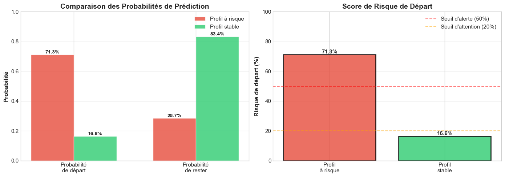
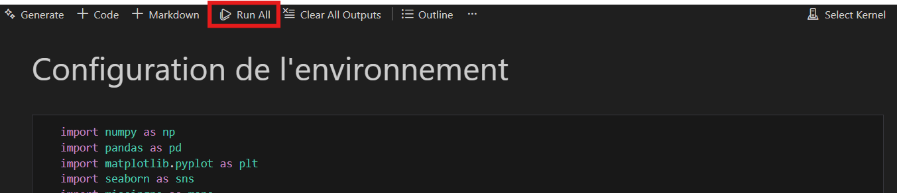

# IA for HumanForYou - Prédiction du Turnover

> Projet Machine Learning éthique pour prédire le départ des employés et proposer des leviers RH actionnables.

**Date** : Décembre 2025  

**Équipe** : Groupe 5 - CESI Analytics

**Auteur** : Mickaël King

**Contributeur** : BALDE Seyni Junior, EL GHAZAL Omar

---

# Sommaire

1. [Problématique](#Problematique)
2. [Données disponibles](#Donnees-disponible)
3. [Installation pré-requis](#Installation-pre-requis)
4. [Fichier à executer](#Fichier-a-executer)
5. [Comment utiliser](#Comment-utiliser)

---

## Problematique

L'entreprise pharmaceutique HumanForYou (4000 employés, Inde) fait face à un taux de rotation de **15% par an** (600 départs). L'objectif est d'identifier les facteurs de départ et de proposer des actions de rétention **éthiques et transparentes**, conformes à l'AI Act 2024.

**Variable cible** : `Attrition` (0 = resté, 1 = parti en 2016)

---

## Donnees disponible

| Dataset                    | Variables | Description                                                        |
|---------------------------|-----------|--------------------------------------------------------------------|
| `general_data.csv`        | 35        | Données RH (âge, genre, salaire, ancienneté, poste, etc.)         |
| `manager_survey_data.csv` | 3         | Évaluation manager (implication, performance)                      |
| `employee_survey_data.csv`| 4         | Enquête satisfaction (environnement, travail, équilibre)          |
| `in_time.csv`             | 1 + dates | Heures d’arrivée par jour (données badgeuse 2015)                 |
| `out_time.csv`            | 1 + dates | Heures de départ par jour (données badgeuse 2015)                 |

**Démarche éthique** : Exclusion variables sensibles (Age, Gender, MaritalStatus) conformément au RGPD et AI Act 2024.

---

## Installation pre-requis

Langage de programmation utilisé : 
- Python
- Jupyter notebook

Bibliothèque et module importante utilisé : 
- NumPy
- Pandas
- Matplotlib
- Seaborn
- Os
- Sys
- Datetime
- Sklearn
- Warning
- Scipy

---

## Fichier a executer

Tout le rapport de ce projet est dans le fichier jupyter notebook suivant : **"notebooks/Livrable_2_Groupe_Seyni.ipynb"**.

Ce fichier contient toute l'explication de notre projet ainsi que du code permettant la création de nos IA.

Nos preuves scientifiques et notre conclusion y sont aussi inclus.

Libre à vous de consulter le fichier si vous voulez tous les détailles de notre projet.

---

## Comment utiliser

Faites simplement tourner chaques cellules dans l'ordre au fur et à mesure que vous parcourer le fichier **"notebooks/Livrable_2_Groupe_Seyni.ipynb"** et tout le programme s'executrera.

